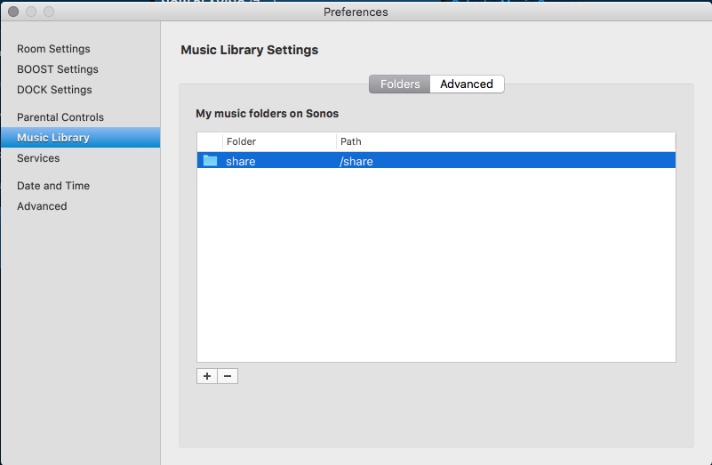
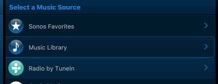
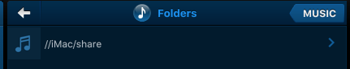
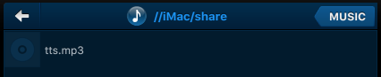
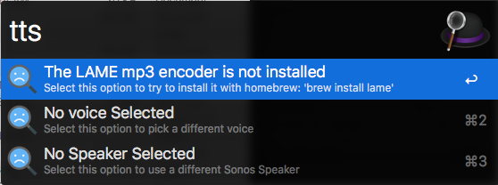

# TTS for Sonos

**COMMANDS:**

* **TTS** - Text to Speech *(Play a TTS phrase)*
* **STV** - Sonos TTS Voice *(Select voice to use)*
* **STS** - Sonos TTS Speaker *(Select the speaker to play on)*

## Setting up the plugin

* This plugin takes advantage of the `SoCo` library (included in the workflow) to control the sonos.

In order to get the file to play correctly you need to do a few things.

First you need to locate a directory that is both shared with sonos and accessible to the computer running the workflow.

In this example we will use the `/share` folder on the local drive

```bash
# I made the directory with these commands
sudo mkdir /share
chmod 777 /share
```



First select your `Music Library` in the Sonos client for OSX



Then navigate to `Folders`


And there you will see the 'sonos' name for your share




In our case its `//iMac/share` (which maps to `/share` on the local disk).  You want to make sure you have a `tts.png` file that exists in this directory.



You can create a placeholder for the file with `touch /share/tts.png` from the command line (this file gets overwritten each time you run the plugin).  After you need to update your music library:

**Manage** - **Update Music Library Now** or try:  `⇧⌘I`

At this point everything "should" be ready to go - there are some additional steps but they are done via the plugin interface

### Additional Steps

### Installing LAME

This plugin needs LAME to be installed.  The first time you run it will prompt you it is not installed.



Selecting the first option will try to install it via homebrew.  If that fails - figure out how to install `LAME` on your own.

### Selecting a Voice and Speakers

Use the `sts` and `stv` commands to select a voice and a speaker to use.

Then you can invoke via `tts` the plugin
